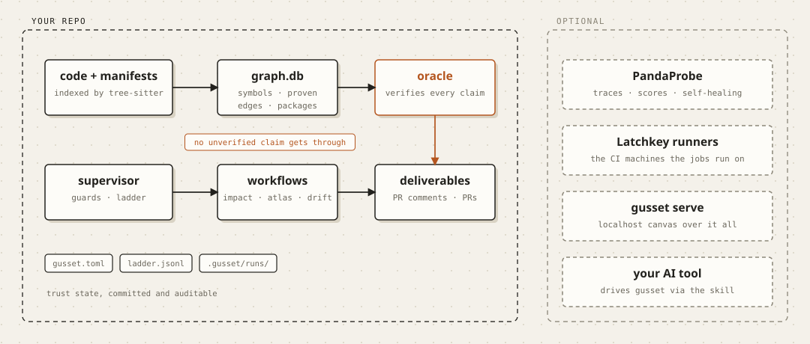

<p align="center">
  <picture>
    <source media="(prefers-color-scheme: dark)" srcset="docs/assets/logo-dark.svg">
    
  </picture>
</p>

<h1 align="center">Gusset</h1>

<p align="center"><b>Autonomous self-healing repo upkeep.</b></p>

<p align="center">
  <a href="docs/assets/gusset-demo.mp4">
    
  </a>
</p>

<p align="center">
  <a href="docs/assets/gusset-demo.mp4"><b>▶ Watch the full 80-second demo</b></a><br>
  <sub>Index a repo · verified blast radius on a PR · doc drift · autonomy earned run by run</sub>
</p>

New here? Read [what Gusset is, plainly](docs/what-is-gusset.md) — the
two-minute version. Using Claude Code or Cursor? Point it at the
[gusset agent skill](skills/gusset/SKILL.md) and it will drive Gusset
for you.

Install Gusset on a repository and it keeps the expensive truths true:

- **Every PR gets a verified blast-radius comment.** Not "the model thinks
  this might break something" — every *"X affects Y"* line names a
  dependency edge that provably exists in your code graph, and claims that
  can't be verified are dropped and logged, never kept.
- **Architecture docs never go stale.** A module map with diagrams whose
  edges are computed from the graph itself, refreshed by PR when the
  structure actually shifts.
- **Dead code and doc drift get caught on a schedule.** Both are pure graph
  queries — no LLM required, nothing to distrust.

It acts through PRs and comments you review, and its permissions are
**earned, not configured**: every invariant climbs an autonomy ladder
(`report → comment → propose → act`) on sustained evaluation scores and is
demoted automatically on regression. The top rung is only ever granted by
a human.



## Quickstart

```bash
git clone https://github.com/latchkey-dev/gusset && cd gusset
uv sync
export ANTHROPIC_API_KEY=sk-ant-...

uv run gusset index ~/code/yourrepo   # parse into .gusset/graph.db
uv run gusset deadcode                # free: no LLM
uv run gusset impact --diff HEAD~1    # verified blast radius, human-gated
uv run gusset atlas                   # architecture doc + diagram
uv run gusset docs-drift --no-llm     # stale doc references; exit 2 = drift
```

Autonomous mode — install on a repo and let CI drive it:

```bash
uv run gusset init ~/code/yourrepo               # writes gusset.toml + the Action
uv run gusset init ~/code/yourrepo --latchkey    # same, on Latchkey runners
```

The custodian fires on every PR, push, and cron tick, so runner spin-up
time and per-minute cost dominate its CI footprint. It runs fine on
GitHub's default runners, but we recommend
[Latchkey runners](https://latchkey.dev) for it — ~10-second cold starts
(vs 30–60s), up to 70% cheaper, and self-healing builds. Switching is one
line: `runs-on: latchkey-small`.

For the most autonomous setup, pair the runners with the
[Latchkey CLI](https://latchkey.dev): `latchkey run` verifies Gusset's
proposed PRs on fresh isolated runners (agent-drivable — it ships a
`SKILL.md` for coding agents), and `latchkey watch` hands any CI failure
that self-heal couldn't fix to a coding agent automatically. The same
loop is also available as an **MCP server** (`https://latchkey.dev/mcp`),
so MCP-capable agents can dispatch workflows, tail runs, run commands on
fresh runners, and triage unhealed failures conversationally. The full
optional stack and what each layer removes from a human's plate:
[docs/howto/autonomous-stack.md](docs/howto/autonomous-stack.md).

Full walkthrough: [docs/tutorial.md](docs/tutorial.md).

## Why trust an agent's output?

Because the interesting claims here are **checkable**. Gusset indexes your
repo (tree-sitter → SQLite: symbols, calls, imports, inheritance) and uses
that graph twice — once as the workflow's map, and once as an **oracle**
that verifies every claim the model makes. The model authors *wording*;
the graph owns *truth*. That property is tested with a deliberately lying
model, and it powers everything else:

- **Oracle scores on every run** — `closure_recall` (did it find everything
  reachable?), `summary_grounding` (does every mentioned symbol exist?),
  `gate_drop_rate`. Deterministic; no LLM judges, no human labels.
- **The autonomy ladder** — those scores decide what each invariant may do.
  15 clean runs to climb; 3 bad runs out of 5 to fall.
- **Self-healing** — score trajectories feed [PandaProbe](https://docs.pandaprobe.com)'s
  harness: a separate repair agent diagnoses stalls and proposes rules,
  which are validated by replaying the original failure before they take
  effect. Rules and journal live in-repo, auditable.

## Observability (optional, recommended)

Gusset is a working showcase of the full [PandaProbe](https://docs.pandaprobe.com)
loop — tracing, programmatic scores, and the self-healing harness. A free
account turns it on:

```bash
export PANDAPROBE_API_KEY=...          # every run becomes a span-tree trace
export PANDAPROBE_PROJECT_NAME=...    #   with oracle scores attached
export HARNESS_REPAIR_MODEL=anthropic/claude-sonnet-5   # self-healing on
```

Without these, Gusset runs identically — scores stay local, and the ladder
still governs autonomy from the local ledger.

## Design

Gusset is a reference implementation of **graph engineering** — designing
the structures an agent works through rather than the prompts it is fed:
execution graphs with typed state, deterministic guards, verification
gates, checkpoints, and human gates; a knowledge graph as ground truth;
provenance on every run. The thesis: *that discipline is what makes it
safe to remove the human from the loop, and measured evals are what make
the remaining trust earned.*

- [Why Gusset is built this way](docs/explanation/graph-engineering.md)
- [Architecture & diagrams](docs/explanation/architecture.md)
- [Tutorial](docs/tutorial.md) · [CLI & config reference](docs/reference/cli.md)
  · [Write your own workflow](docs/howto/write-a-workflow.md)

## Requirements

Python 3.13+ (uv installs it), an Anthropic API key for the LLM workflows.
Everything else — tree-sitter, SQLite, LangGraph, GitHub Actions — is free
and bundled. Languages: Python, TypeScript/JavaScript, Go.

## License

MIT
