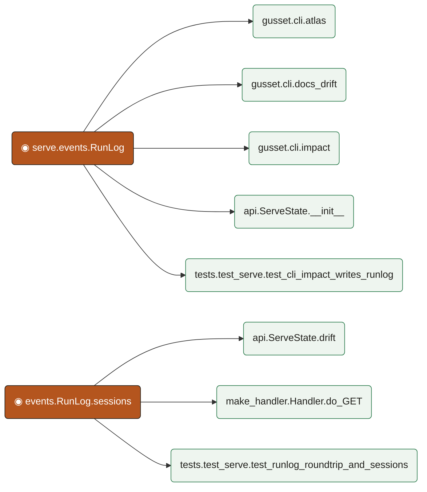

# Impact analysis

**Seeds:** src.gusset.serve.events.RunLog, src.gusset.serve.events.RunLog.sessions

Changes to `RunLog` and `RunLog.sessions` propagate to eight confirmed call sites. On the constructor/write path, `src.gusset.cli.impact`, `src.gusset.cli.atlas`, and `src.gusset.cli.docs_drift` all construct and invoke `RunLog` to record run results, and `src.gusset.serve.api.ServeState.__init__` initializes server state with a `RunLog` instance, so signature, default, or persistence changes can break these commands and server startup. On the read path, `src.gusset.serve.api.ServeState.drift` and `src.gusset.serve.server.make_handler.Handler.do_GET` consume `RunLog.sessions` to derive drift data and serve it to clients, making them sensitive to changes in return shape, ordering, or filtering. Two tests cover this surface directly and will need review: `tests.test_serve.test_cli_impact_writes_runlog` (asserts on RunLog creation and written contents) and `tests.test_serve.test_runlog_roundtrip_and_sessions` (exercises serialization round-tripping and the sessions accessor).

## Verified impacts

- `src.gusset.cli.atlas` — depth 1, calls edge to `src.gusset.serve.events.RunLog`: This command calls RunLog to emit run records, so changes to RunLog's API or persistence semantics could cause call-site errors or missing/malformed atlas run entries.
- `src.gusset.cli.docs_drift` — depth 1, calls edge to `src.gusset.serve.events.RunLog`: It calls RunLog when reporting docs-drift results, so altered RunLog behavior or arguments could break the command or change the drift output it records.
- `src.gusset.cli.impact` — depth 1, calls edge to `src.gusset.serve.events.RunLog`: It directly constructs/invokes RunLog to record impact-analysis runs, so any change to RunLog's constructor signature, defaults, or write behavior can break or alter this CLI command's logging path.
- `src.gusset.serve.api.ServeState.__init__` — depth 1, calls edge to `src.gusset.serve.events.RunLog`: Server state is initialized with a RunLog instance, so constructor or initialization-side-effect changes in RunLog can break server startup or leave ServeState holding an incompatible log object.
- `src.gusset.serve.api.ServeState.drift` — depth 1, calls edge to `src.gusset.serve.events.RunLog.sessions`: It reads RunLog.sessions to derive drift information, so changes to that accessor's return shape, ordering, or filtering can silently change or break the drift response.
- `src.gusset.serve.server.make_handler.Handler.do_GET` — depth 1, calls edge to `src.gusset.serve.events.RunLog.sessions`: The HTTP GET handler surfaces RunLog.sessions data to clients, so changes to session structure or availability can alter served payloads or raise errors during request handling.
- `tests.test_serve.test_cli_impact_writes_runlog` — depth 1, calls edge to `src.gusset.serve.events.RunLog`: This test asserts on RunLog creation and written contents from the impact CLI, so any behavioral or format change in RunLog will likely make its assertions fail.
- `tests.test_serve.test_runlog_roundtrip_and_sessions` — depth 1, calls edge to `src.gusset.serve.events.RunLog.sessions`: This test exercises RunLog persistence round-tripping and the sessions accessor directly, so it is highly sensitive to any change in their serialization format or returned values.

_8 claims verified against the code graph; 0 dropped at the gate._

