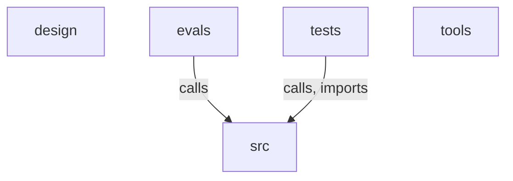

# Architecture atlas

## Module map

## design

The `design` module holds presentation-layer assets rather than product logic, split into two independent halves with no cross-module dependencies. `design.architecture.gen_diagrams` is a small SVG generation library built around the `design.architecture.gen_diagrams.SVG` class, whose drawing primitives (`design.architecture.gen_diagrams.SVG.title`, `design.architecture.gen_diagrams.SVG.node`, `design.architecture.gen_diagrams.SVG.edge`, `design.architecture.gen_diagrams.SVG.pill`, `design.architecture.gen_diagrams.SVG.group`, `design.architecture.gen_diagrams.SVG.chip` and `design.architecture.gen_diagrams.SVG.render`) are driven by one function per diagram — `design.architecture.gen_diagrams.system_context`, `design.architecture.gen_diagrams.impact_graph`, `design.architecture.gen_diagrams.ladder`, `design.architecture.gen_diagrams.healing`, `design.architecture.gen_diagrams.readme_hero`, `design.architecture.gen_diagrams.stack_layers` and `design.architecture.gen_diagrams.map_oracle` — each of which instantiates `design.architecture.gen_diagrams.SVG` directly. `design.demo.demo` is a browser-side scripted walkthrough: view builders such as `design.demo.demo.appHeader`, `design.demo.demo.graphSide` (with its local helper `design.demo.demo.graphSide.frow`), `design.demo.demo.graphFieldSVG` (seeded by `design.demo.demo.mulberry32`), `design.demo.demo.scoreRow`, `design.demo.demo.prDiagramSVG`, `design.demo.demo.staleCard`, `design.demo.demo.bars`, `design.demo.demo.row` and `design.demo.demo.logoSVG` render scene markup, while `design.demo.demo.$` and `design.demo.demo.set` provide DOM access and the fake-terminal helpers `design.demo.demo.term`, `design.demo.demo.pinTerm`, `design.demo.demo.termAppend` and `design.demo.demo.killCursors` animate console output. Playback is sequenced by `design.demo.demo.compile`, `design.demo.demo.exec` and `design.demo.demo.tick`, with `design.demo.demo.resetStage` clearing state between scenes and `design.demo.demo.start` kicking off the run.

_39 symbols_: `design.architecture.gen_diagrams.SVG`, `design.architecture.gen_diagrams.SVG.__init__`, `design.architecture.gen_diagrams.SVG.title`, `design.architecture.gen_diagrams.SVG.node`, `design.architecture.gen_diagrams.SVG.edge`, `design.architecture.gen_diagrams.SVG.pill`, `design.architecture.gen_diagrams.SVG.group`, `design.architecture.gen_diagrams.SVG.chip`, `design.architecture.gen_diagrams.SVG.render`, `design.architecture.gen_diagrams.system_context`, `design.architecture.gen_diagrams.impact_graph`, `design.architecture.gen_diagrams.ladder`, `design.architecture.gen_diagrams.healing`, `design.architecture.gen_diagrams.readme_hero`, `design.architecture.gen_diagrams.stack_layers`, `design.architecture.gen_diagrams.map_oracle`, `design.demo.demo.$`, `design.demo.demo.logoSVG`, `design.demo.demo.mulberry32`, `design.demo.demo.appHeader`, `design.demo.demo.graphSide`, `design.demo.demo.graphSide.frow`, `design.demo.demo.graphFieldSVG`, `design.demo.demo.impPos`, `design.demo.demo.scoreRow`, `design.demo.demo.prDiagramSVG`, `design.demo.demo.staleCard`, `design.demo.demo.bars`, `design.demo.demo.row`, `design.demo.demo.term`, `design.demo.demo.pinTerm`, `design.demo.demo.termAppend`, `design.demo.demo.killCursors`, `design.demo.demo.resetStage`, `design.demo.demo.set`, `design.demo.demo.compile`, `design.demo.demo.exec`, `design.demo.demo.tick`, `design.demo.demo.start`

## evals

The `evals` module is a self-contained benchmarking harness that compares Gusset's graph-backed impact analysis against a plain file-search baseline. `evals.corpus` assembles the evaluation set: it indexes real or generated repositories via `evals.corpus._index` (which delegates to `src.gusset.graph.indexer.index_repo`) into a `evals.corpus.Corpus`, derives ground truth with `evals.corpus.closure_truth`, picks starting points in `evals.corpus.select_seeds`, and exposes everything through `evals.corpus.load_questions`. Each question is answered twice — by `evals.baseline.run_baseline`, which hands an LLM the `evals.baseline.make_tools.read_file` and `evals.baseline.make_tools.grep` tools, and by `evals.gusset_runner.run_gusset`, which calls `src.gusset.workflows.impact.build_impact_graph` while `evals.gusset_runner.UsageTally` records token usage — after which `evals.measure.measure_claims` scores the claims against the `src.gusset.graph.store.GraphStore`. `evals.run_experiment` is the entry point that ties these together: `evals.run_experiment.run_all` drives both runners and appends scored rows, and `evals.run_experiment.aggregate` computes summary statistics and emits a Markdown report through `evals.run_experiment._render_md`.

_32 symbols_: `evals.baseline._source_files`, `evals.baseline.make_tools`, `evals.baseline.make_tools.read_file`, `evals.baseline.make_tools.grep`, `evals.baseline._text_of`, `evals.baseline._add_usage`, `evals.baseline.run_baseline`, `evals.corpus.Corpus`, `evals.corpus._index`, `evals.corpus.build_real_corpus`, `evals.corpus.build_synth_corpus`, `evals.corpus.generate_synthetic_repo`, `evals.corpus.closure_truth`, `evals.corpus.select_seeds`, `evals.corpus.load_questions`, `evals.gusset_runner.UsageTally`, `evals.gusset_runner.UsageTally.__init__`, `evals.gusset_runner.UsageTally.on_llm_end`, `evals.gusset_runner.run_gusset`, `evals.measure.resolve_claim`, `evals.measure.measure_claims`, `evals.run_experiment._model_name`, `evals.run_experiment._load_rows`, `evals.run_experiment._append_row`, `evals.run_experiment._make_models`, `evals.run_experiment.run_all`, `evals.run_experiment._mean`, `evals.run_experiment._median`, `evals.run_experiment._cost`, `evals.run_experiment.aggregate`, `evals.run_experiment._fmt`, `evals.run_experiment._render_md`

## src

`src` is the entire Gusset application: a multi-language code-graph indexer, three LLM workflows that reason over that graph, a supervisor that triggers them from events, and a local web dashboard. Ingestion is driven by `src.gusset.graph.indexer.index_repo`, which walks the repo with `src.gusset.graph.walk.walk_files`, pulls definitions and references out of each file via `src.gusset.graph.extract.extract`, attributes external names using `src.gusset.graph.manifest.parse_manifests` and `src.gusset.graph.tsmodules.collect`, and persists into the SQLite database opened by `src.gusset.graph.schema.connect`; every downstream consumer reads it back through `src.gusset.graph.store.GraphStore`. The workflows `src.gusset.workflows.impact.build_impact_graph`, `src.gusset.workflows.atlas.build_atlas_graph`, and `src.gusset.workflows.docsdrift.build_docsdrift_graph` each expand, verify, and synthesize claims against the store (seeded for diffs by `src.gusset.workflows.seeds.seeds_from_diff`), are graded by `src.gusset.oracle.scores.score_impact_run` and `src.gusset.oracle.scores.score_atlas_run`, and are instrumented through `src.gusset.probe.tracing.make_callbacks` and `src.gusset.probe.selfheal.SelfHealing`. They are invoked either from the CLI entry point `src.gusset.cli.main` or automatically by `src.gusset.supervisor.runner.handle_event`, which reads `src.gusset.supervisor.config.load_config`, checks the autonomy `src.gusset.supervisor.ladder.Ladder`, and reports via `src.gusset.supervisor.actions.deliver`; every run is appended to `src.gusset.serve.events.RunLog` and streamed by `src.gusset.serve.server.serve` and `src.gusset.serve.heartbeat.Heartbeat` to the browser client started in `src.gusset.serve.static.app.boot`.

_344 symbols_: `src.gusset.cli._db_path`, `src.gusset.cli.main`, `src.gusset.cli.version`, `src.gusset.cli.index`, `src.gusset.cli.stats`, `src.gusset.cli.impact`, `src.gusset.cli.impact._run`, `src.gusset.cli.atlas`, `src.gusset.cli.atlas._run`, `src.gusset.cli.docs_drift`, `src.gusset.cli.docs_drift._run`, `src.gusset.cli.serve`, `src.gusset.cli.init`, `src.gusset.cli.run_event`, `src.gusset.cli._finish`, `src.gusset.cli.deadcode`, `src.gusset.cli.deadcode.row`, `src.gusset.graph.extract.Def`, `src.gusset.graph.extract.Ref`, `src.gusset.graph.extract.Extraction`, `src.gusset.graph.extract.extract`, `src.gusset.graph.extract._text`, `src.gusset.graph.extract._callee_parts`, `src.gusset.graph.extract._callee_name`, `src.gusset.graph.extract._walk_python`, `src.gusset.graph.extract._walk_ts`, `src.gusset.graph.extract._go_receiver_type`, `src.gusset.graph.extract._walk_go`, `src.gusset.graph.indexer._module_qualname`, `src.gusset.graph.indexer._git_commit`, `src.gusset.graph.indexer._PackageMaps`, `src.gusset.graph.indexer._PackageMaps.__init__`, `src.gusset.graph.indexer._insert_packages`, `src.gusset.graph.indexer._resolve_external`, `src.gusset.graph.indexer.index_repo`, `src.gusset.graph.indexer.index_repo.resolve`, `src.gusset.graph.manifest.PackageDep`, `src.gusset.graph.manifest.norm_dist`, `src.gusset.graph.manifest._parse_pep508`, `src.gusset.graph.manifest._uv_lock_versions`, `src.gusset.graph.manifest._npm_lock_versions`, `src.gusset.graph.manifest._parse_pyproject`, `src.gusset.graph.manifest._parse_package_json`, `src.gusset.graph.manifest._parse_go_mod`, `src.gusset.graph.manifest.parse_manifests`, `src.gusset.graph.schema.connect`, `src.gusset.graph.store.Symbol`, `src.gusset.graph.store._symbol`, `src.gusset.graph.store.cluster_key`, `src.gusset.graph.store.GraphStore`, `src.gusset.graph.store.GraphStore.__init__`, `src.gusset.graph.store.GraphStore.close`, `src.gusset.graph.store.GraphStore.symbol_by_qualname`, `src.gusset.graph.store.GraphStore.symbols_by_name`, `src.gusset.graph.store.GraphStore.search`, `src.gusset.graph.store.GraphStore.symbols_overlapping`, `src.gusset.graph.store.GraphStore.symbols_by_qualname_suffix`, `src.gusset.graph.store.GraphStore.symbols_by_dotted_path`, `src.gusset.graph.store.GraphStore.symbol_by_id`, `src.gusset.graph.store.GraphStore.edges_between`, `src.gusset.graph.store.GraphStore.edge_exists`, `src.gusset.graph.store.GraphStore.dependents`, `src.gusset.graph.store.GraphStore.dependencies`, `src.gusset.graph.store.GraphStore.reverse_closure`, `src.gusset.graph.store.GraphStore.dead_symbols`, `src.gusset.graph.store.GraphStore.unverified_symbols`, `src.gusset.graph.store.GraphStore.unresolved_refs`, `src.gusset.graph.store.GraphStore.packages`, `src.gusset.graph.store.GraphStore.package_dependents`, `src.gusset.graph.store.GraphStore.module_clusters`, `src.gusset.graph.store.GraphStore.edge_listing`, `src.gusset.graph.store.GraphStore.cluster_edges`, `src.gusset.graph.store.GraphStore.stats`, `src.gusset.graph.tsmodules._strip_jsonc`, `src.gusset.graph.tsmodules._load_jsonc`, `src.gusset.graph.tsmodules.TsProject`, `src.gusset.graph.tsmodules.TsProject.__bool__`, `src.gusset.graph.tsmodules._resolve_extends`, `src.gusset.graph.tsmodules.collect`, `src.gusset.graph.tsmodules._strip_ext`, `src.gusset.graph.tsmodules._module_candidates`, `src.gusset.graph.tsmodules.candidates`, `src.gusset.graph.walk.walk_files`, `src.gusset.llm.make_model`, `src.gusset.oracle.scores.Score`, `src.gusset.oracle.scores.score_impact_run`, `src.gusset.oracle.scores.score_atlas_run`, `src.gusset.oracle.scores._module_coverage`, `src.gusset.oracle.scores._atlas_gate_drop_rate`, `src.gusset.oracle.scores._closure_recall`, `src.gusset.oracle.scores._closure_confidence`, `src.gusset.oracle.scores._gate_drop_rate`, `src.gusset.oracle.scores._summary_grounding`, `src.gusset.probe.scoring._find_trace_id`, `src.gusset.probe.scoring.push_scores`, `src.gusset.probe.selfheal._oracle_verifier`, `src.gusset.probe.selfheal.SelfHealing`, `src.gusset.probe.selfheal.SelfHealing.__init__`, `src.gusset.probe.selfheal.SelfHealing.bind_loop`, `src.gusset.probe.selfheal.SelfHealing.enabled`, `src.gusset.probe.selfheal.SelfHealing.create`, `src.gusset.probe.selfheal.SelfHealing.system_preamble`, `src.gusset.probe.selfheal.SelfHealing.turn_hook`, `src.gusset.probe.selfheal.SelfHealing._turn_payload`, `src.gusset.probe.selfheal.SelfHealing.settle`, `src.gusset.probe.selfheal._replay_impact`, `src.gusset.probe.tracing.probe_enabled`, `src.gusset.probe.tracing._RetryDigest`, `src.gusset.probe.tracing._RetryDigest.__init__`, `src.gusset.probe.tracing._RetryDigest.filter`, `src.gusset.probe.tracing.install_retry_digest`, `src.gusset.probe.tracing.retry_digest_note`, `src.gusset.probe.tracing.make_callbacks`, `src.gusset.probe.tracing.trace_url_hint`, `src.gusset.serve.api.ServeState`, `src.gusset.serve.api.ServeState.__init__`, `src.gusset.serve.api.ServeState.store`, `src.gusset.serve.api.ServeState.meta`, `src.gusset.serve.api.ServeState.graph`, `src.gusset.serve.api.ServeState.symbol`, `src.gusset.serve.api.ServeState.impact_model`, `src.gusset.serve.api.ServeState.ladder`, `src.gusset.serve.api.ServeState.drift`, `src.gusset.serve.api.ServeState.allowlist_get`, `src.gusset.serve.api.ServeState.allowlist_add`, `src.gusset.serve.api.ServeState.doc_excerpt`, `src.gusset.serve.api.ServeState.validate_keys`, `src.gusset.serve.api.ServeState.write_env`, `src.gusset.serve.api._n`, `src.gusset.serve.api._as_count`, `src.gusset.serve.api._check_http`, `src.gusset.serve.api._ensure_gitignored`, `src.gusset.serve.blastimage.blast_svg`, `src.gusset.serve.blastimage._short`, `src.gusset.serve.blastimage.blast_mermaid`, `src.gusset.serve.blastimage.blast_mermaid.nid`, `src.gusset.serve.blastimage.blast_mermaid.label`, `src.gusset.serve.events.runs_dir`, `src.gusset.serve.events.RunLog`, `src.gusset.serve.events.RunLog.__init__`, `src.gusset.serve.events.RunLog.path_for`, `src.gusset.serve.events.RunLog.append`, `src.gusset.serve.events.RunLog.turn_hook`, `src.gusset.serve.events.RunLog.turn_hook.hook`, `src.gusset.serve.events.RunLog.start`, `src.gusset.serve.events.RunLog.signal`, `src.gusset.serve.events.RunLog.finish`, `src.gusset.serve.events.RunLog.sessions`, `src.gusset.serve.events.RunLog.read`, `src.gusset.serve.events._count`, `src.gusset.serve.heartbeat.Heartbeat`, `src.gusset.serve.heartbeat.Heartbeat.__init__`, `src.gusset.serve.heartbeat.Heartbeat.subscribe`, `src.gusset.serve.heartbeat.Heartbeat.unsubscribe`, `src.gusset.serve.heartbeat.Heartbeat.client_count`, `src.gusset.serve.heartbeat.Heartbeat.start`, `src.gusset.serve.heartbeat.Heartbeat._watch`, `src.gusset.serve.heartbeat.Heartbeat._scan`, `src.gusset.serve.heartbeat.Heartbeat._publish`, `src.gusset.serve.server.make_handler`, `src.gusset.serve.server.make_handler.Handler`, `src.gusset.serve.server.make_handler.Handler.log_message`, `src.gusset.serve.server.make_handler.Handler._sse`, `src.gusset.serve.server.make_handler.Handler._json`, `src.gusset.serve.server.make_handler.Handler.do_GET`, `src.gusset.serve.server.make_handler.Handler.do_POST`, `src.gusset.serve.server.make_handler.Handler._static`, `src.gusset.serve.server.serve`, `src.gusset.serve.static.app.applyTheme`, `src.gusset.serve.static.app.setHeader`, `src.gusset.serve.static.app.setLive`, `src.gusset.serve.static.app.remount`, `src.gusset.serve.static.app.syncConnected`, `src.gusset.serve.static.app.defaultHeader`, `src.gusset.serve.static.app.parseHash`, `src.gusset.serve.static.app.navigate`, `src.gusset.serve.static.app.setSync`, `src.gusset.serve.static.app.routeFor`, `src.gusset.serve.static.app.followToast`, `src.gusset.serve.static.app.onStart`, `src.gusset.serve.static.app.onIndexSignal`, `src.gusset.serve.static.app.handleEvent`, `src.gusset.serve.static.app.boot`, `src.gusset.serve.static.sim.createSim`, `src.gusset.serve.static.sim.createSim.tick`, `src.gusset.serve.static.sim.createSim.reheat`, `src.gusset.serve.static.sim.createSim.stop`, `src.gusset.serve.static.util.getJSON`, `src.gusset.serve.static.util.postJSON`, `src.gusset.serve.static.util.el`, `src.gusset.serve.static.util.svg`, `src.gusset.serve.static.util.applyAttrs`, `src.gusset.serve.static.util.append`, `src.gusset.serve.static.util.clear`, `src.gusset.serve.static.util.fmtClock`, `src.gusset.serve.static.util.fmtStamp`, `src.gusset.serve.static.util.fmtScore`, `src.gusset.serve.static.util.fmtInt`, `src.gusset.serve.static.util.codeBox`, `src.gusset.serve.static.util.toast`, `src.gusset.serve.static.util.explainer`, `src.gusset.serve.static.util.explainer.setOpen`, `src.gusset.serve.static.util.emptyState`, `src.gusset.serve.static.util.tokens`, `src.gusset.serve.static.views.drift.driftHelp`, `src.gusset.serve.static.views.drift.explain`, `src.gusset.serve.static.views.drift.mountDrift`, `src.gusset.serve.static.views.drift.docExcerpt`, `src.gusset.serve.static.views.drift.truncMiddle`, `src.gusset.serve.static.views.drift.shortDoc`, `src.gusset.serve.static.views.graph.graphHelp`, `src.gusset.serve.static.views.graph.mountGraph`, `src.gusset.serve.static.views.graph.mountGraph.recomputeVisible`, `src.gusset.serve.static.views.graph.mountGraph.updateShownFoot`, `src.gusset.serve.static.views.graph.mountGraph.updateCapChip`, `src.gusset.serve.static.views.graph.mountGraph.selectNode`, `src.gusset.serve.static.views.graph.mountGraph.renderDeps`, `src.gusset.serve.static.views.graph.mountGraph.deselect`, `src.gusset.serve.static.views.graph.mountGraph.toggleNeighborhood`, `src.gusset.serve.static.views.graph.mountGraph.resize`, `src.gusset.serve.static.views.graph.mountGraph.fit`, `src.gusset.serve.static.views.graph.mountGraph.centerOn`, `src.gusset.serve.static.views.graph.mountGraph.draw`, `src.gusset.serve.static.views.graph.mountGraph.onMove`, `src.gusset.serve.static.views.graph.mountGraph.onUp`, `src.gusset.serve.static.views.graph.mountGraph.hitTest`, `src.gusset.serve.static.views.graph.mountGraph.frame`, `src.gusset.serve.static.views.graph.shortName`, `src.gusset.serve.static.views.graph.legendRow`, `src.gusset.serve.static.views.graph.dotSwatch`, `src.gusset.serve.static.views.graph.svgSearchIcon`, `src.gusset.serve.static.views.impact.impactHelp`, `src.gusset.serve.static.views.impact.boxesOverlap`, `src.gusset.serve.static.views.impact.mountImpact`, `src.gusset.serve.static.views.impact.mountImpact.labelSpec`, `src.gusset.serve.static.views.impact.mountImpact.nudge`, `src.gusset.serve.static.views.impact.mountImpact.paintLabel`, `src.gusset.serve.static.views.impact.mountImpact.hoverLabel`, `src.gusset.serve.static.views.impact.mountImpact.render`, `src.gusset.serve.static.views.impact.mountImpact.applyTurn`, `src.gusset.serve.static.views.impact.mountImpact.stopPlay`, `src.gusset.serve.static.views.impact.shortName`, `src.gusset.serve.static.views.ladder.ladderHelp`, `src.gusset.serve.static.views.ladder.mountLadder`, `src.gusset.serve.static.views.ladder.invariantCard`, `src.gusset.serve.static.views.ladder.ledgerLine`, `src.gusset.serve.static.views.setup.mountSetup`, `src.gusset.serve.static.views.setup.mountSetup.statusEl`, `src.gusset.serve.static.views.setup.mountSetup.setStatus`, `src.gusset.serve.static.views.setup.mountSetup.collectKeys`, `src.gusset.serve.static.views.setup.mountSetup.validate`, `src.gusset.serve.static.views.setup.mountSetup.field`, `src.gusset.serve.static.views.workflow.workflowHelp`, `src.gusset.serve.static.views.workflow.mountWorkflow`, `src.gusset.serve.static.views.workflow.mountWorkflow.derive`, `src.gusset.serve.static.views.workflow.mountWorkflow.statuses`, `src.gusset.serve.static.views.workflow.mountWorkflow.renderAll`, `src.gusset.serve.static.views.workflow.mountWorkflow.poll`, `src.gusset.serve.static.views.workflow.mountWorkflow.schedule`, `src.gusset.serve.static.views.workflow.boxStyle`, `src.gusset.serve.static.views.workflow.renderDag`, `src.gusset.serve.static.views.workflow.feedLine`, `src.gusset.serve.static.views.workflow.renderFeed`, `src.gusset.supervisor.actions.ActionReceipt`, `src.gusset.supervisor.actions._gh`, `src.gusset.supervisor.actions._compare_url`, `src.gusset.supervisor.actions.deliver`, `src.gusset.supervisor.config.Invariant`, `src.gusset.supervisor.config.Invariant.__post_init__`, `src.gusset.supervisor.config.GussetConfig`, `src.gusset.supervisor.config.GussetConfig.for_trigger`, `src.gusset.supervisor.config.GussetConfig.get`, `src.gusset.supervisor.config.load_config`, `src.gusset.supervisor.ladder.Level`, `src.gusset.supervisor.ladder.Level.parse`, `src.gusset.supervisor.ladder.Level.__str__`, `src.gusset.supervisor.ladder.LadderDecision`, `src.gusset.supervisor.ladder.Ladder`, `src.gusset.supervisor.ladder.Ladder.__init__`, `src.gusset.supervisor.ladder.Ladder.record_run`, `src.gusset.supervisor.ladder.Ladder._entries`, `src.gusset.supervisor.ladder.Ladder.current_level`, `src.gusset.supervisor.ladder.Ladder.evaluate`, `src.gusset.supervisor.ladder.Ladder._record_level`, `src.gusset.supervisor.runner.Event`, `src.gusset.supervisor.runner.RunReceipt`, `src.gusset.supervisor.runner.handle_event`, `src.gusset.supervisor.runner._run_invariant`, `src.gusset.supervisor.runner._execute_workflow`, `src.gusset.supervisor.runner._with_blast_image`, `src.gusset.supervisor.runner._run_graph_workflow`, `src.gusset.supervisor.runner._run_graph_workflow._run`, `src.gusset.supervisor.runner._run_impact`, `src.gusset.supervisor.runner._run_impact._run`, `src.gusset.supervisor.runner.receipts_json`, `src.gusset.workflows.atlas.SymbolRef`, `src.gusset.workflows.atlas.ModuleSummary`, `src.gusset.workflows.atlas.AtlasState`, `src.gusset.workflows.atlas._gate_prose`, `src.gusset.workflows.atlas._gate_prose._log`, `src.gusset.workflows.atlas._gate_prose._edge`, `src.gusset.workflows.atlas._gate_prose._mention`, `src.gusset.workflows.atlas.build_atlas_graph`, `src.gusset.workflows.atlas.build_atlas_graph._fire`, `src.gusset.workflows.atlas.build_atlas_graph.partition`, `src.gusset.workflows.atlas.build_atlas_graph.after_partition`, `src.gusset.workflows.atlas.build_atlas_graph.summarize_module`, `src.gusset.workflows.atlas.build_atlas_graph.verify_gate`, `src.gusset.workflows.atlas.build_atlas_graph.after_gate`, `src.gusset.workflows.atlas.build_atlas_graph.synthesize`, `src.gusset.workflows.atlas.build_atlas_graph.human_gate`, `src.gusset.workflows.atlas._mermaid_id`, `src.gusset.workflows.atlas._render`, `src.gusset.workflows.docsdrift._anchored`, `src.gusset.workflows.docsdrift.Claim`, `src.gusset.workflows.docsdrift.DocsDriftState`, `src.gusset.workflows.docsdrift.load_allowlist`, `src.gusset.workflows.docsdrift.build_docsdrift_graph`, `src.gusset.workflows.docsdrift.build_docsdrift_graph._fire`, `src.gusset.workflows.docsdrift.build_docsdrift_graph.extract_claims`, `src.gusset.workflows.docsdrift.build_docsdrift_graph.check_claims`, `src.gusset.workflows.docsdrift.build_docsdrift_graph.after_check`, `src.gusset.workflows.docsdrift.build_docsdrift_graph.explain`, `src.gusset.workflows.docsdrift.build_docsdrift_graph.synthesize`, `src.gusset.workflows.docsdrift.build_docsdrift_graph.human_gate`, `src.gusset.workflows.docsdrift._ground_prose`, `src.gusset.workflows.docsdrift._render`, `src.gusset.workflows.impact._append`, `src.gusset.workflows.impact.Candidate`, `src.gusset.workflows.impact.ImpactState`, `src.gusset.workflows.impact._content_text`, `src.gusset.workflows.impact._parse_explanations`, `src.gusset.workflows.impact.build_impact_graph`, `src.gusset.workflows.impact.build_impact_graph._fire`, `src.gusset.workflows.impact.build_impact_graph.resolve_seeds`, `src.gusset.workflows.impact.build_impact_graph.after_seeds`, `src.gusset.workflows.impact.build_impact_graph.expand_ring`, `src.gusset.workflows.impact.build_impact_graph.verify_gate`, `src.gusset.workflows.impact.build_impact_graph.after_gate`, `src.gusset.workflows.impact.build_impact_graph.synthesize`, `src.gusset.workflows.impact.build_impact_graph.human_gate`, `src.gusset.workflows.impact._render`, `src.gusset.workflows.seeds.changed_lines`, `src.gusset.workflows.seeds.seeds_from_diff`

## tests

The `tests` module is the project's verification layer, pairing a large corpus of synthetic fixture repositories under tests.fixtures — Python (`tests.fixtures.pyproj.pkg.models.Child` inheriting `tests.fixtures.pyproj.pkg.models.Base`), Go (`tests.fixtures.goproj.greeter.Greeter.Greet`, `tests.fixtures.gotest.calc_test.TestAdd`), TypeScript/TSX (`tests.fixtures.tsproj.shapes.Fancy`, `tests.fixtures.tsxapp.page.HomePage`) and a monorepo (`tests.fixtures.tsmono.packages.shared.src.index.makeStatus`) — with test suites that index those fixtures and assert exact graph facts. Indexing and extraction behaviour is covered per-language by `tests.test_graph`, `tests.test_graph_go`, `tests.test_graph_ts`, `tests.test_graph_tsx`, `tests.test_tsmodules`, `tests.test_deps` and `tests.test_no_fabrication`, which drive `src.gusset.graph.indexer.index_repo`, `src.gusset.graph.extract.extract`, `src.gusset.graph.manifest.parse_manifests` and `src.gusset.graph.store.GraphStore` and check that no edges are invented. The agentic workflows are exercised end-to-end through local `fake_model`/`run_to_interrupt` helpers in `tests.test_impact`, `tests.test_atlas` and `tests.test_docsdrift` against `src.gusset.workflows.impact.build_impact_graph`, `src.gusset.workflows.atlas.build_atlas_graph` and `src.gusset.workflows.docsdrift.build_docsdrift_graph`, with grounding scored via `src.gusset.oracle.scores.score_impact_run` and `src.gusset.oracle.scores.score_atlas_run` in `tests.test_oracle` and `tests.test_oracle_atlas`. Remaining suites cover the surrounding runtime: `tests.test_supervisor` and `tests.test_runner` for `src.gusset.supervisor.config.load_config`, `src.gusset.supervisor.ladder.Ladder` and `src.gusset.supervisor.runner.handle_event`, and `tests.test_serve`, `tests.test_heartbeat`, `tests.test_blastimage`, `tests.test_cli`, `tests.test_cli_graph`, `tests.test_seeds`, `tests.test_selfheal` and `tests.test_probe_digest` for the HTTP/event, rendering, CLI and self-healing surfaces.

_249 symbols_: `tests.fixtures.fabrication.service.Vault`, `tests.fixtures.fabrication.service.Vault.get`, `tests.fixtures.fabrication.service.Vault.set`, `tests.fixtures.goproj.app.main`, `tests.fixtures.goproj.app.report`, `tests.fixtures.goproj.greeter.Greeter`, `tests.fixtures.goproj.greeter.Speaker`, `tests.fixtures.goproj.greeter.Greeter.Greet`, `tests.fixtures.goproj.greeter.Greeter.Rename`, `tests.fixtures.goproj.greeter.decorate`, `tests.fixtures.goproj.greeter.Unused`, `tests.fixtures.gotest.calc.Add`, `tests.fixtures.gotest.calc.Unused`, `tests.fixtures.gotest.calc_test.TestAdd`, `tests.fixtures.gotest.calc_test.BenchmarkAdd`, `tests.fixtures.modulescope.helper.buildApp`, `tests.fixtures.pyproj.app.main`, `tests.fixtures.pyproj.pkg.lib.helper`, `tests.fixtures.pyproj.pkg.lib._internal`, `tests.fixtures.pyproj.pkg.lib.unused_fn`, `tests.fixtures.pyproj.pkg.models.Base`, `tests.fixtures.pyproj.pkg.models.Base.describe`, `tests.fixtures.pyproj.pkg.models.Child`, `tests.fixtures.pyproj.pkg.models.Child.describe`, `tests.fixtures.tsmono.apps.api.src.routes.health.healthRoute`, `tests.fixtures.tsmono.apps.web.src.app.page.Page`, `tests.fixtures.tsmono.apps.web.src.lib.api.fetchStatus`, `tests.fixtures.tsmono.packages.shared.src.index.makeStatus`, `tests.fixtures.tsproj.app.fmt`, `tests.fixtures.tsproj.app.main`, `tests.fixtures.tsproj.shapes.Base`, `tests.fixtures.tsproj.shapes.Base.area`, `tests.fixtures.tsproj.shapes.Fancy`, `tests.fixtures.tsproj.shapes.Fancy.area`, `tests.fixtures.tsproj.shapes.Fancy.describe`, `tests.fixtures.tsproj.util.helper`, `tests.fixtures.tsproj.util.double`, `tests.fixtures.tsproj.util.unusedExport`, `tests.fixtures.tsxapp.badge.StatusBadge`, `tests.fixtures.tsxapp.page.Client`, `tests.fixtures.tsxapp.page.Client.constructor`, `tests.fixtures.tsxapp.page.HomePage`, `tests.fixtures.tsxapp.panel.Panel`, `tests.test_atlas.db`, `tests.test_atlas.fake_model`, `tests.test_atlas.run_to_interrupt`, `tests.test_atlas.test_full_run_produces_verified_atlas`, `tests.test_atlas.test_lying_model_claims_are_rewritten_and_logged`, `tests.test_atlas.test_single_file_repo_yields_one_cluster`, `tests.test_atlas.test_empty_graph_halts_honestly`, `tests.test_atlas.test_rejection_leaves_report_unapproved`, `tests.test_atlas.test_turn_hook_fires_per_gate_and_synthesize`, `tests.test_atlas.test_block_list_content_from_thinking_models`, `tests.test_blastimage.claims`, `tests.test_blastimage.test_svg_is_valid_xml_with_expected_elements`, `tests.test_blastimage.test_overflow_is_aggregated_not_drawn`, `tests.test_blastimage.test_qualname_labels_are_escaped`, `tests.test_blastimage.test_empty_run_renders_without_error`, `tests.test_blastimage.test_mermaid_structure_and_quoting`, `tests.test_blastimage.test_mermaid_overflow_note`, `tests.test_cli.test_version_command`, `tests.test_cli.test_no_args_shows_help`, `tests.test_cli_graph.test_index_stats_deadcode_roundtrip`, `tests.test_cli_graph.test_missing_db_is_a_clear_error`, `tests.test_deps.store`, `tests.test_deps.test_parse_pyproject_fixture`, `tests.test_deps.test_parse_pyproject_extras_optional_and_lock`, `tests.test_deps.test_parse_package_json_and_lock`, `tests.test_deps.test_parse_go_mod`, `tests.test_deps.test_parse_manifests_at_any_depth_and_malformed`, `tests.test_deps.test_shallower_manifests_come_first`, `tests.test_deps.test_parse_manifests_missing_root`, `tests.test_deps.test_package_nodes_exist`, `tests.test_deps.test_imports_external_edges`, `tests.test_deps.test_undeclared_import_stays_unresolved`, `tests.test_deps.test_unresolved_refs_drop_with_manifest`, `tests.test_deps.test_js_bare_specifier_resolution`, `tests.test_deps.test_go_module_path_prefix_resolution`, `tests.test_deps.test_packages_query`, `tests.test_deps.test_package_dependents`, `tests.test_deps.test_dead_symbols_exclude_packages`, `tests.test_deps.test_reverse_closure_from_package_seed`, `tests.test_deps.test_module_views_stay_code_only`, `tests.test_deps.test_stats_report_external_layer`, `tests.test_deps.test_stats_zero_when_no_manifest`, `tests.test_deps.test_connect_adds_version_column_to_old_db`, `tests.test_docsdrift.db`, `tests.test_docsdrift.fake_model`, `tests.test_docsdrift.run_to_interrupt`, `tests.test_docsdrift.test_stale_and_valid_references_reported_with_lines`, `tests.test_docsdrift.store_for_self`, `tests.test_docsdrift.test_no_drift_runs_without_a_model`, `tests.test_docsdrift.test_drift_without_model_degrades_to_deterministic_explanation`, `tests.test_docsdrift.test_suffix_reference_resolves`, `tests.test_docsdrift.test_explanation_mentions_are_grounded`, `tests.test_docsdrift.test_rejection_leaves_report_unapproved`, `tests.test_docsdrift.test_turn_hook_fires_at_check_and_synthesize`, `tests.test_docsdrift.test_unanchored_dotted_prose_is_not_drift`, `tests.test_docsdrift.test_anchored_missing_symbol_is_still_drift`, `tests.test_docsdrift.test_interior_abbreviation_resolves`, `tests.test_docsdrift.test_anchor_must_be_a_container_not_a_function`, `tests.test_graph.store`, `tests.test_graph.test_symbols_extracted`, `tests.test_graph.test_call_edges`, `tests.test_graph.test_inheritance_edge`, `tests.test_graph.test_import_edges`, `tests.test_graph.test_no_fabricated_edges`, `tests.test_graph.test_reverse_closure_is_impact_ground_truth`, `tests.test_graph.test_dead_symbols`, `tests.test_graph.test_dependents_and_dependencies`, `tests.test_graph.test_search`, `tests.test_graph.test_symbols_by_qualname_suffix`, `tests.test_graph.test_module_clusters_partition`, `tests.test_graph.test_edge_listing_matches_edge_exists`, `tests.test_graph.test_cluster_edges_are_inter_module_only`, `tests.test_graph.test_stats`, `tests.test_graph_go.store`, `tests.test_graph_go.test_symbols_extracted`, `tests.test_graph_go.test_call_edges`, `tests.test_graph_go.test_no_fabricated_edges`, `tests.test_graph_go.test_reverse_closure_is_impact_ground_truth`, `tests.test_graph_go.test_dead_symbols`, `tests.test_graph_go.test_grouped_import_form`, `tests.test_graph_go.test_go_test_entry_points_are_not_dead`, `tests.test_graph_ts.store`, `tests.test_graph_ts.test_symbols_extracted`, `tests.test_graph_ts.test_call_edges`, `tests.test_graph_ts.test_inheritance_edge`, `tests.test_graph_ts.test_import_edges`, `tests.test_graph_ts.test_no_fabricated_edges`, `tests.test_graph_ts.test_reverse_closure_is_impact_ground_truth`, `tests.test_graph_ts.test_dead_symbols`, `tests.test_graph_ts.test_js_and_tsx_grammar_variants`, `tests.test_graph_tsx.store`, `tests.test_graph_tsx.test_jsx_element_is_a_reference`, `tests.test_graph_tsx.test_intrinsic_elements_are_not_symbols`, `tests.test_graph_tsx.test_closing_tag_does_not_double_count`, `tests.test_graph_tsx.test_default_export_is_an_edge`, `tests.test_graph_tsx.test_anonymous_default_export_records_nothing`, `tests.test_graph_tsx.test_constructor_is_not_dead_code`, `tests.test_heartbeat.wait_for`, `tests.test_heartbeat.test_watcher_only_streams_new_events`, `tests.test_heartbeat.test_signal_events_flow_but_stay_out_of_sessions`, `tests.test_heartbeat.test_partial_line_not_emitted_until_complete`, `tests.test_heartbeat.test_sse_end_to_end`, `tests.test_heartbeat.test_sse_end_to_end.listen`, `tests.test_impact.db`, `tests.test_impact.fake_model`, `tests.test_impact.run_to_interrupt`, `tests.test_impact.test_full_run_verifies_real_chain`, `tests.test_impact.test_unknown_seed_halts_honestly`, `tests.test_impact.test_garbage_model_output_degrades_wording_not_correctness`, `tests.test_impact.test_block_list_content_from_thinking_models`, `tests.test_impact.test_rejection_leaves_report_unapproved`, `tests.test_impact.test_leaf_symbol_yields_contained_report`, `tests.test_impact.test_module_scope_dependents_are_reported`, `tests.test_no_fabrication.test_qualified_calls_are_not_guessed`, `tests.test_no_fabrication.test_self_calls_still_resolve`, `tests.test_no_fabrication.test_unresolved_refs_are_recorded_not_just_counted`, `tests.test_oracle.db`, `tests.test_oracle.by_name`, `tests.test_oracle.full_state`, `tests.test_oracle.test_perfect_run_scores_perfectly`, `tests.test_oracle.test_missing_impact_lowers_recall`, `tests.test_oracle.test_invented_symbol_in_prose_is_caught`, `tests.test_oracle.test_gate_drops_are_measured`, `tests.test_oracle.test_abbreviated_dotted_paths_ground_correctly`, `tests.test_oracle.test_partial_state_mid_run_scores_without_error`, `tests.test_oracle.test_push_scores_noop_without_credentials`, `tests.test_oracle.test_closure_confidence_catches_a_blind_neighbourhood`, `tests.test_oracle.test_closure_confidence_is_full_when_nothing_was_refused`, `tests.test_oracle_atlas.db`, `tests.test_oracle_atlas.by_name`, `tests.test_oracle_atlas.full_state`, `tests.test_oracle_atlas.test_perfect_run_scores_perfectly`, `tests.test_oracle_atlas.test_missing_module_section_lowers_coverage`, `tests.test_oracle_atlas.test_section_for_unknown_module_does_not_inflate_coverage`, `tests.test_oracle_atlas.test_invented_symbol_in_draft_is_caught`, `tests.test_oracle_atlas.test_gate_drops_are_measured_in_prose_claims`, `tests.test_oracle_atlas.test_zero_claims_gives_zero_drop_rate`, `tests.test_probe_digest._fresh_digest`, `tests.test_probe_digest._record`, `tests.test_probe_digest.test_retry_warnings_are_suppressed_and_counted`, `tests.test_probe_digest.test_exhausted_upload_error_still_prints`, `tests.test_probe_digest.test_unrelated_warnings_pass_through`, `tests.test_probe_digest.test_singular_wording`, `tests.test_probe_digest.test_no_note_when_nothing_suppressed`, `tests.test_runner.repo`, `tests.test_runner.setup`, `tests.test_runner.test_cron_runs_deadcode_and_skips_nothing_silently`, `tests.test_runner.test_impact_guard_skips_doc_only_diff`, `tests.test_runner.test_impact_without_diff_is_guarded`, `tests.test_runner.test_workflow_crash_is_receipted_not_fatal`, `tests.test_runner.test_workflow_crash_is_receipted_not_fatal.boom`, `tests.test_runner.test_impact_runs_and_scores_via_monkeypatched_workflow`, `tests.test_runner.test_impact_runs_and_scores_via_monkeypatched_workflow.fake_run_impact`, `tests.test_seeds.git`, `tests.test_seeds.test_seeds_from_diff`, `tests.test_selfheal.db`, `tests.test_selfheal._model`, `tests.test_selfheal.test_turn_hook_fires_per_turn_with_accumulated_state`, `tests.test_selfheal.test_preamble_reaches_system_messages`, `tests.test_selfheal.test_preamble_reaches_system_messages.SpyModel`, `tests.test_selfheal.test_preamble_reaches_system_messages.SpyModel.invoke`, `tests.test_selfheal.test_verifier_ignores_midrun_turns`, `tests.test_selfheal.test_verifier_recomputes_oracle_truth`, `tests.test_selfheal.test_disabled_without_credentials`, `tests.test_serve.state`, `tests.test_serve.seed_run`, `tests.test_serve.test_runlog_roundtrip_and_sessions`, `tests.test_serve.test_impact_model_assembles_final_state`, `tests.test_serve.test_graph_and_symbol_endpoints_shape`, `tests.test_serve.test_http_routes_end_to_end`, `tests.test_serve.test_http_routes_end_to_end.get`, `tests.test_serve.test_post_csrf_defenses`, `tests.test_serve.test_post_csrf_defenses.post`, `tests.test_serve.test_allowlist_and_doc_excerpt`, `tests.test_serve.test_setup_write_env_merges_and_gitignores`, `tests.test_serve.test_cli_impact_writes_runlog`, `tests.test_serve.test_runs_found_beside_a_non_default_db`, `tests.test_serve.test_heartbeat_watches_the_same_directory`, `tests.test_serve.test_heartbeat_watches_the_same_directory.FakeHeartbeat`, `tests.test_serve.test_heartbeat_watches_the_same_directory.FakeHeartbeat.__init__`, `tests.test_serve.test_heartbeat_watches_the_same_directory.FakeHeartbeat.start`, `tests.test_serve.test_drift_view_reports_three_buckets_separately`, `tests.test_supervisor.test_default_toml_parses`, `tests.test_supervisor.test_autonomy_above_ceiling_rejected`, `tests.test_supervisor.test_unknown_workflow_rejected`, `tests.test_supervisor.ladder`, `tests.test_supervisor.good`, `tests.test_supervisor.bad`, `tests.test_supervisor.test_rate_scores_are_normalized_lower_is_better`, `tests.test_supervisor.test_promotion_needs_full_streak`, `tests.test_supervisor.test_one_bad_run_resets_streak`, `tests.test_supervisor.test_demotion_is_faster_than_promotion`, `tests.test_supervisor.test_ceiling_is_respected`, `tests.test_supervisor.test_ladder_never_grants_act`, `tests.test_supervisor.test_histories_are_isolated_per_invariant`, `tests.test_supervisor.test_branch_pushed_receipt_carries_a_clickable_compare_url`, `tests.test_supervisor.test_compare_url_says_what_to_do_when_the_repo_is_unknown`, `tests.test_tsmodules.store`, `tests.test_tsmodules.test_nodenext_js_specifier_resolves_to_source`, `tests.test_tsmodules.test_tsconfig_path_alias_resolves`, `tests.test_tsmodules.test_workspace_package_resolves`, `tests.test_tsmodules.test_cross_package_calls_resolve`, `tests.test_tsmodules.test_nothing_is_left_unresolved`, `tests.test_tsmodules.test_alias_does_not_leak_across_projects`, `tests.test_tsmodules.test_unknown_specifier_resolves_to_nothing`, `tests.test_tsmodules.test_jsonc_comments_are_stripped_without_eating_strings`

## tools

Note: I wasn't able to load rules.md — no rule-harness tools are actually exposed in this session, so the summary below reflects only the module data provided.

The `tools` module is a small, self-contained corner of the codebase, exposing a single documented symbol: the function `tools.fabrication_audit.src`. Its only recorded relationship is internal, with `tools.fabrication_audit` calling `tools.fabrication_audit.src`, which suggests the audit entry point delegates to this function for its underlying work. The module has no recorded edges to or from any other module, so it neither depends on nor is depended upon by the rest of the system in the current graph. New contributors can therefore treat `tools` as an isolated utility area that can be read and modified largely in isolation, though the absence of external edges may also mean its integration points are simply not yet captured in the graph.

_1 symbols_: `tools.fabrication_audit.src`

_5 module summaries verified against the code graph (124 symbol mentions kept, 1 claims dropped at the gate); diagram edges are computed from the graph, never from prose._
