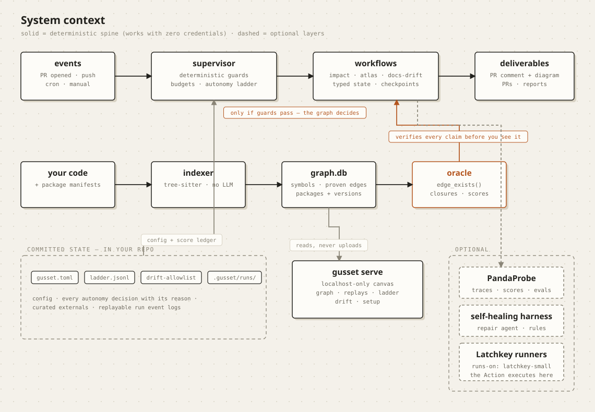
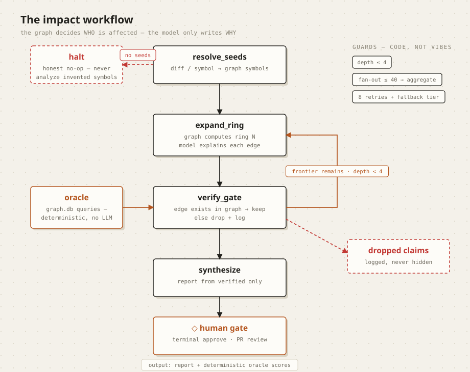
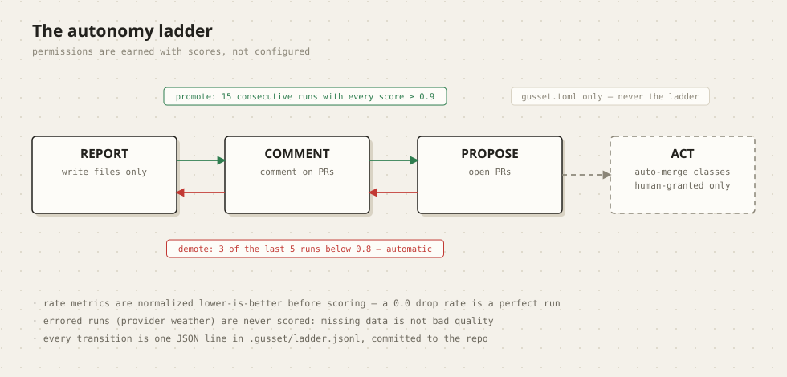
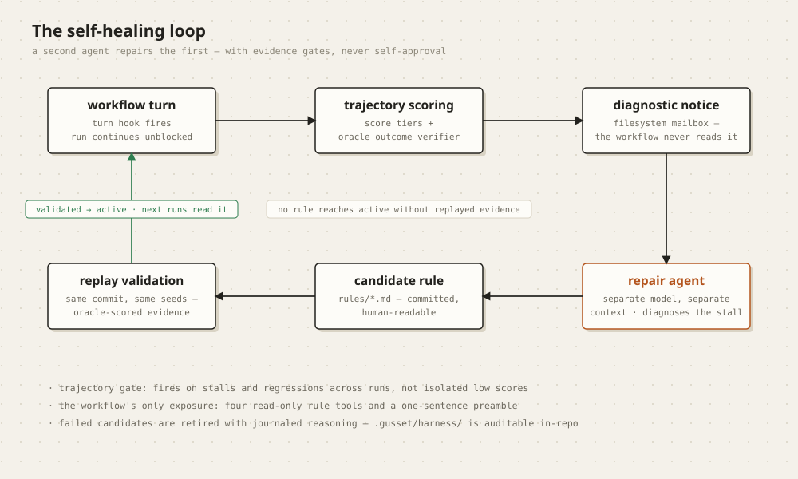

# Architecture

Four diagrams, four layers of the same idea: **a map of provable facts,
and machinery that never lets a claim past it unchecked.** (Diagrams are
generated from `design/architecture/gen_diagrams.py` — edit there, re-run,
never hand-edit the SVGs.)

## System context

The **solid spine is deterministic** and works with zero credentials: code
is parsed (tree-sitter, no LLM) into `graph.db` — symbols, proven
call/import/inheritance edges, and external packages with their
lockfile-resolved versions. The **oracle** is the same database asked a
harder question: *does this claimed relationship exist?* Every workflow
claim is verified through it before anything is delivered.

The **supervisor** routes events (PRs, pushes, cron) through guards that
are code, not model judgment — a doc-only diff never wakes the LLM, and
every skipped invariant produces a receipt naming the guard that stopped
it. What survives the workflows arrives as PR comments (with a Mermaid
blast diagram GitHub renders natively), PRs, or reports, depending on the
autonomy level the invariant has *earned*.

Everything trust-relevant is **committed to your repo**: `gusset.toml`
(config and human-granted ceilings), `ladder.jsonl` (every autonomy
decision, with its reason), the drift allowlist, and replayable run event
logs. `gusset serve` is a localhost-only canvas over that state — it
reads, never uploads. PandaProbe (tracing, scores, evals) and the
self-healing harness are optional layers; without credentials they
degrade to off and everything else behaves identically.

## The impact workflow

The division of labor is strict: **the graph decides WHO is affected; the
model only writes WHY.** Rings of dependents are computed from graph
edges; the model contributes one explanatory sentence per edge; the
verify gate then re-checks every claim against the oracle. Claims that
fail are dropped *and logged* — the report's footer counts them, and the
serve UI shows them struck through with their reason. Unknown seeds halt
the run honestly rather than analyzing invented symbols.

Guards bound the traversal (depth ≤ 4, fan-out ≤ 40 aggregates by module)
and the provider (8 retries plus an automatic fallback model tier —
capacity incidents are often tier-scoped, a live-outage lesson). Every
run ends with deterministic oracle scores: `closure_recall` (found
everything reachable?), `summary_grounding` (every mentioned symbol
exists?), `gate_drop_rate`. No LLM judges anywhere in scoring.

## The autonomy ladder

Levels define what an invariant may do; scores decide what it has earned.
Promotion needs 15 consecutive runs with every score ≥ 0.9; demotion
takes only 3 breaches in the last 5 — trust is deliberately asymmetric.
Three details that matter in practice: rate-style metrics are normalized
lower-is-better before scoring (a 0.0 drop rate is a *perfect* run — a
bug the serve ladder view caught before any user did); errored runs from
provider weather are never scored, because missing data is not evidence
of bad quality; and `ACT` is unreachable by promotion — only a human
grants it, in `gusset.toml`.

## The self-healing loop

A second agent repairs the first, with evidence gates in between. Turn
hooks feed trajectory scoring (which includes the oracle as an outcome
verifier — ground truth, not LLM vibes); stalls and regressions — never
isolated low scores — produce a diagnostic notice in a filesystem mailbox
the workflow never reads. A separate repair agent diagnoses and writes a
candidate rule; the rule reaches `active` only after replaying the
original failure (same commit, same seeds — the deterministic substrate
makes replay honest) shows improvement. Failed candidates are retired
with journaled reasoning. The workflow's total exposure to all of this:
four read-only rule tools and a one-sentence preamble.

The harness workspace (`.gusset/harness/` — rules, journal, mailbox) is
committed to the repo, so learned rules survive ephemeral CI runners and
every repair decision is auditable in review.
