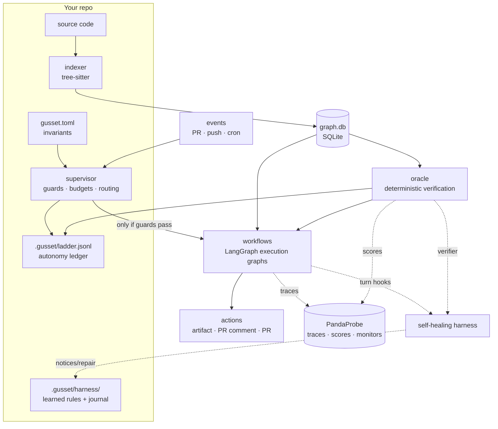
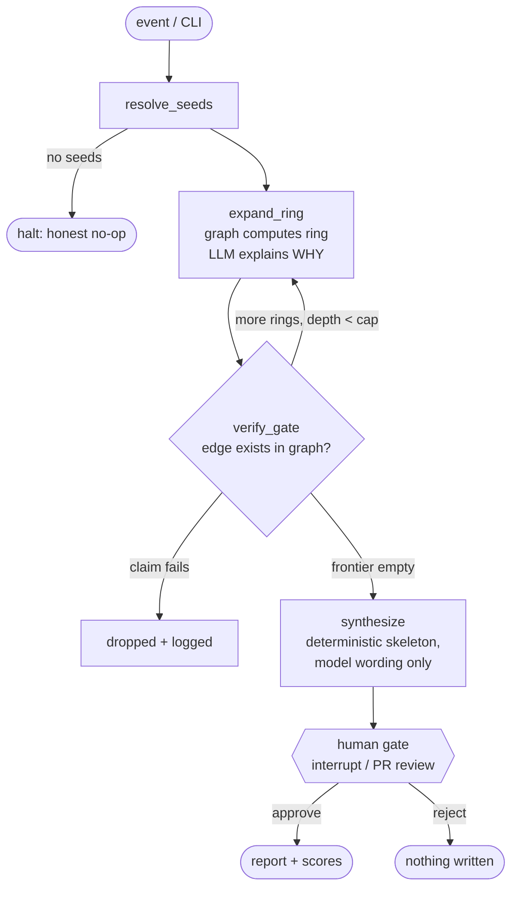
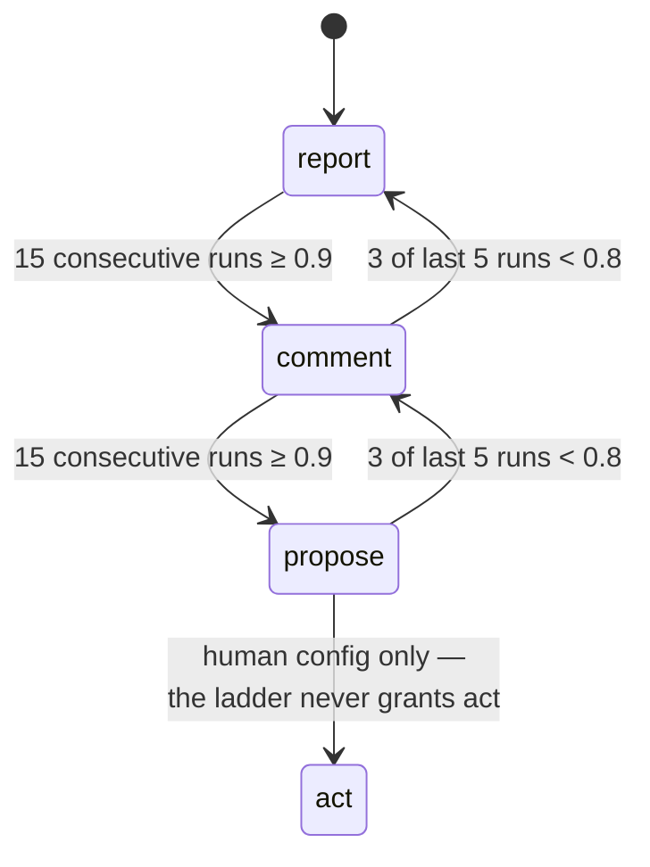
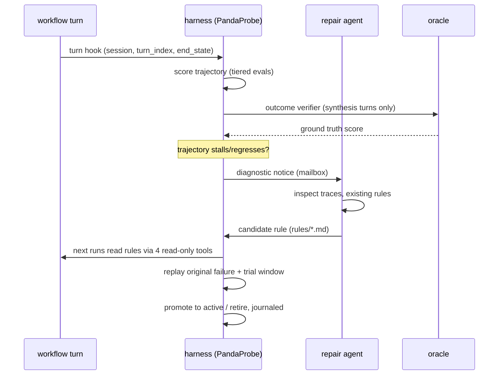

# Architecture

## System context

Solid arrows are the deterministic spine — they work with zero credentials.
Dotted arrows are the observability layer: PandaProbe tracing, oracle score
push, and the self-healing harness. All of it degrades to off.

## The impact workflow's execution graph

The division of labor is strict: **the graph decides WHAT is affected, the
model only explains WHY.** Model output can degrade the wording of a
report, never its truth — that property is tested with a deliberately
lying fake model.

## The autonomy ladder

Promotion is slow, demotion is fast, the ceiling is human-granted per
invariant (`max_autonomy`), and every transition is a ledger entry with its
reason. The scores driving it come from the oracle — deterministic
verification against the code graph — so no human labels anything and no
LLM judges itself.

## The self-healing loop

The workflow never sees the mailbox and the repair agent never blocks a
run. Rules earn `active` status through replayed evidence — the same
philosophy as the ladder, one level down.
