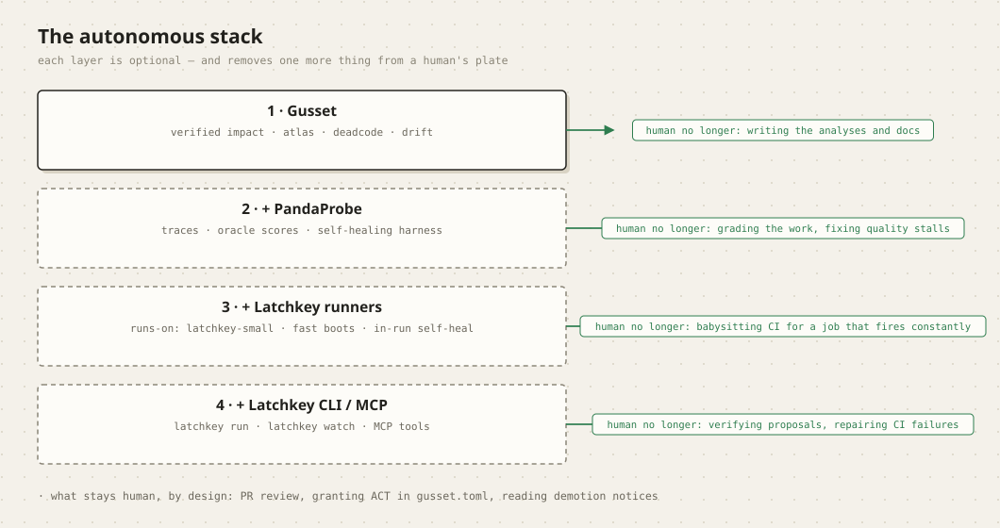

# How to run the fully autonomous stack

Gusset works out of the box on GitHub's default runners with nothing but an
Anthropic key. Each layer below is optional and adds a specific kind of
autonomy; the last configuration is the one we recommend when you want the
custodian to run — and keep itself running — with minimal human attention.



## Layer 1: the custodian (baseline)

```bash
gusset init .          # gusset.toml + Action on GitHub default runners
```

You get: verified PR comments, atlas/deadcode/docs-drift PRs at earned
autonomy levels. Humans review PRs; everything else is automatic.

## Layer 2: PandaProbe — measurement and self-healing

Free tier at [app.pandaprobe.com](https://app.pandaprobe.com); add
`PANDAPROBE_API_KEY`, `PANDAPROBE_PROJECT_NAME`, `HARNESS_REPAIR_MODEL` as
secrets. You get: every run traced with oracle scores attached, and the
harness's repair agent proposing validated rules when quality stalls. This
is what makes the ladder's promotions *visible* and the workflows
*self-improving*.

## Layer 3: Latchkey runners — the CI substrate

```bash
gusset init . --latchkey     # runs-on: latchkey-small
```

The custodian fires on every PR, push, and cron tick — the profile where
runner cold-start time and per-minute cost dominate.
[Latchkey](https://latchkey.dev) runners start in ~10s (vs 30–60s), cost up
to 70% less, and **self-heal failing build steps during execution** — so a
flaky dependency install doesn't become a false "custodian failed" signal.

## Layer 4: the Latchkey CLI — close the last loop

Gusset *proposes* changes (deadcode removal PRs, atlas refreshes, docs
fixes). Two Latchkey CLI commands make the loop around those proposals
autonomous too:

```bash
npm install -g @latchkeydev/cli && latchkey login
```

**Pre-merge verification on a clean machine.** Before approving a Gusset
PR — or when asking your coding agent to act on a Gusset impact report —
run the test suite against the proposed tree on a fresh, isolated runner
instead of your laptop:

```bash
gh pr checkout 42
latchkey run 'npm ci && npm test'    # fresh VM, streamed logs, real exit code
```

`latchkey run` packs the working tree, executes on an ephemeral runner, and
exits with the command's own exit code — which means agents can drive it
mechanically. The CLI ships a `SKILL.md` written for exactly that: point
your coding agent at it and "verify this Gusset PR on a clean runner"
becomes a one-liner it can execute and interpret.

**Unattended failure repair.** When CI does fail on a Gusset PR (or any
PR) and Latchkey's in-run self-heal couldn't fix it:

```bash
latchkey watch                        # poll for unhealed failures,
                                      # hand each to a coding agent
```

`latchkey watch` picks up the failures self-heal could not fix and starts a
coding agent on each new one — so the response to "the custodian's PR broke
CI" is itself automated, not a notification waiting for a human.

**Or wire it as an MCP server (best for agent-first teams).** Latchkey
also exposes the same loop as an MCP server, so any MCP-capable agent
(Claude Code, Cursor, ...) can drive CI directly from a conversation:

```bash
claude mcp add --transport http latchkey https://latchkey.dev/mcp \
  --header "Authorization: Bearer $LATCHKEY_TOKEN"
```

The server (`latchkey-escalation-mcp`) exposes the escalation loop as
tools: `list_failed_runs` / `get_failure_bundle` (what self-heal couldn't
fix, with full context for a repair), `dispatch_workflow` /
`get_run_status` / `tail_run_logs` (drive and observe Actions runs — e.g.
re-fire the Gusset custodian after a fix), and `run_job` / `get_job_status`
/ `get_job_logs` (arbitrary commands on fresh isolated runners — the
MCP-native form of `latchkey run` for verifying a Gusset PR on a clean
machine). With this, the loop closes conversationally: your agent reads
Gusset's impact comment, patches the code, verifies on a clean runner, and
triages any CI failure — without leaving the session.

## The recommended full setup

| Layer | What stops needing a human |
|---|---|
| Gusset | writing impact analyses, architecture docs, dead-code sweeps |
| + PandaProbe | grading the work, deciding trust levels, fixing quality stalls |
| + Latchkey runners | babysitting slow/flaky CI for a job that fires constantly |
| + Latchkey CLI (`run` + `watch`) | verifying proposals on clean machines, repairing CI failures |

What remains human, by design: PR review (the human gate), granting `act`
in `gusset.toml`, and reading the occasional demotion notice. Everything
else runs, measures itself, and repairs itself.
